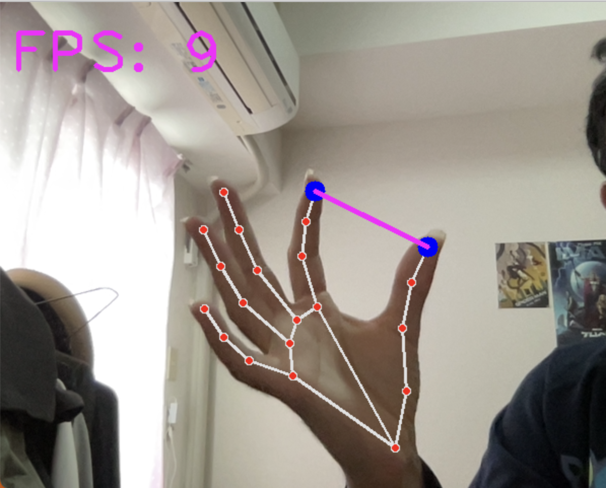

# Volume-Control-using-Hand-Gesture
Using this Python program we can control the volume of mac, linux and windows PC using hand gesture.

## Table of Contents
- [About](#about)
- [Getting Started](#getting_started)
- [Installing](#installing)
- [Usage](#usage)
- [References](#references)

## About
- Using this program you can control the volume of your PC using hand gesture in real time.

## Getting Started
- To run the project first clone the repo on your working environment using Git Clone command.

- I have used google's mediapipe hand lanmark model from which we can get landmark points of hands.

    - Mediapipe Hand Landmark Model [https://google.github.io/mediapipe/solutions/hands.html]

    - 

## Installing
- To run the program first install all the required packages using the following command on command prompt.All the used packages are in requirements.txt file
   > pip install -r requirements.txt

## Usage
- Now run the following command to execute the program.
    - Windows
        > python3 HandVolumeControl_Windows.py
    - Mac or Linux
        > python3 HandVolumeControl_Mac.py

-  Some images from running the program.

    - Drawing Hand Landmarks on real time.
      
    
    - Volume Control using hand gesture on real time.
      
    
    - Real time volume control video

## References

- Hand Landmark Model https://google.github.io/mediapipe/solutions/hands.html

- Volume Control Library for Windows https://github.com/AndreMiras/pycaw

- Volume Control Library for Mac https://github.com/andrewp-as-is/osascript.py